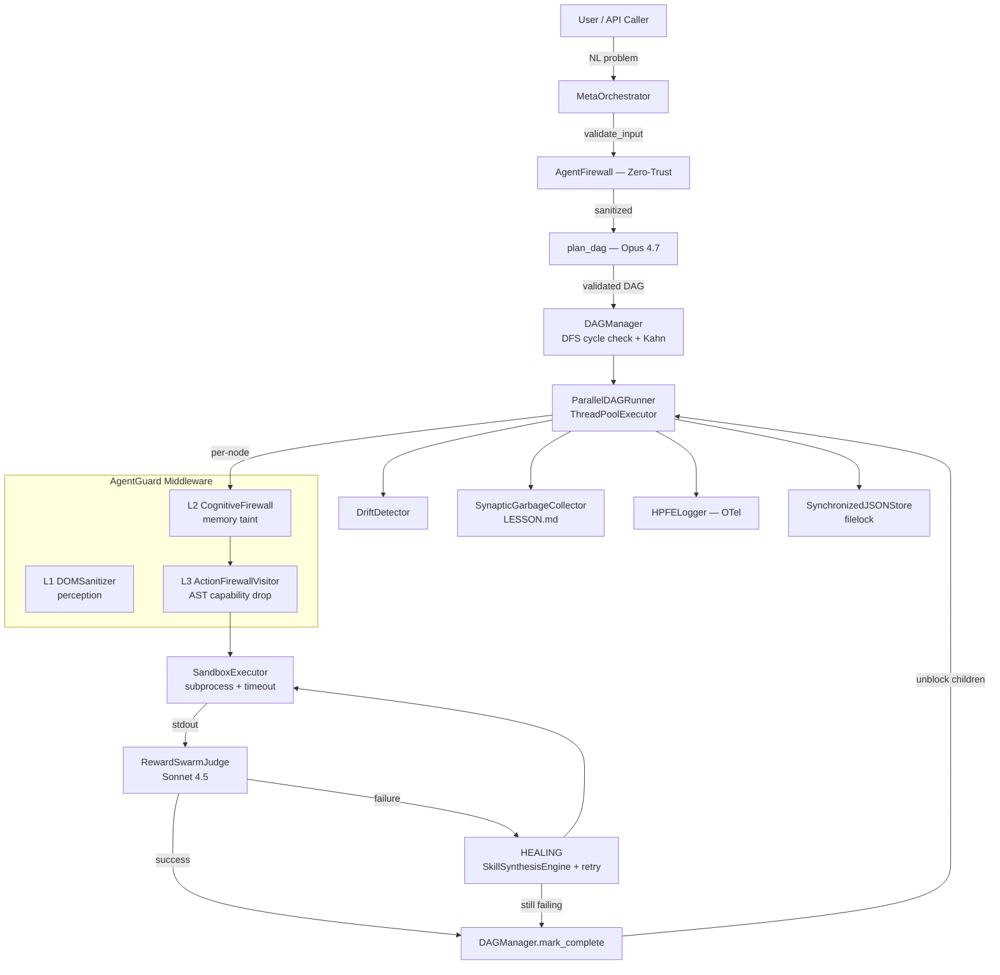
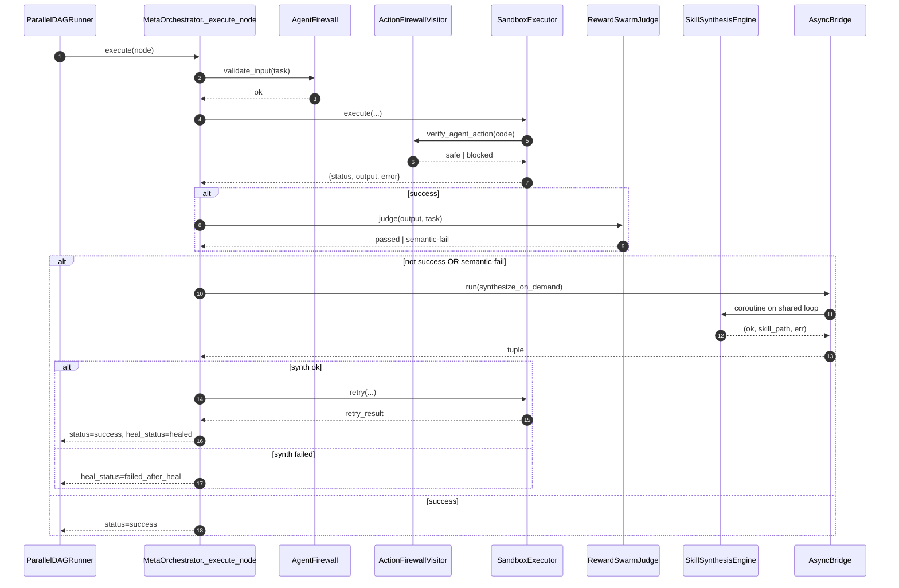

<div align="center">

# Swarm-Forge

**Self-Healing Autonomous Multi-Agent DAG Orchestrator**

_Neo-AGI · Python 3.12 · Anthropic Opus / Sonnet / Haiku_

`zero-trust` · `semantic-reward` · `boardroom-HITL` · `synaptic-immunity` · `HERMES-skill-synthesis`


</div>

---

## Why Swarm-Forge?

**Most multi-agent frameworks die the moment reality hits.** They have no cycle detection, no input validation, no semantic verification of outputs, no recovery path when a node fails, no protection against prompt injection or AST-level sandbox escapes, and no persistent memory of past failures.

Swarm-Forge was built to survive production. It ingests a natural-language enterprise problem, plans a validated DAG via Opus 4.7, executes it in **sandboxed parallel subprocesses**, and every single stage is guarded by a **three-layer zero-trust middleware** that neutralizes the DeepMind AI-Agent-Trap taxonomy (Perception → Memory Taint → Behavioral Control). When a node fails, we don't just mark it red — we enter a **HEALING** state, synthesize a fresh skill via the HERMES Test-Time Tool Evolution paradigm, and retry.

Clone, `docker compose up`, and you have an enterprise-grade swarm orchestrator in 60 seconds.

---

## Getting Started in 60 Seconds

```bash
git clone https://github.com/your-org/swarm-forge.git && cd swarm-forge
cp .env.example .env && $EDITOR .env          # set ANTHROPIC_API_KEY
docker compose up orchestrator                # ← that's it
```

No Anthropic key? Run the mock path locally:

```bash
pip install -r requirements.txt
python demo.py                                 # graceful mock DAG fallback
python demo.py --test                          # wiring / import self-test
pytest tests/ -v                               # 213 tests
```

Programmatic API:

```python
from src import MetaOrchestrator

result = MetaOrchestrator(max_workers=4).run(
    "Decompose and execute our Q2 supply-chain migration plan."
)
print(result["status"], result["execution_time_sec"])
# completed 12.437
```

---

## Feature Matrix

| Capability | Status | Subsystem | Evidence |
|---|:---:|---|---|
| Natural-language → validated DAG | ✅ | `plan_dag` (Opus 4.7, Haiku fallback) | `src/dag_planner.py` |
| DFS cycle detection (WHITE/GRAY/BLACK) | ✅ | `DAGManager._detect_cycles` | `src/dag_execution_engine.py:315` |
| Parallel execution (Kahn + ThreadPool) | ✅ | `ParallelDAGRunner` | `src/dag_execution_engine.py:360` |
| Subprocess sandbox isolation | ✅ | `SandboxExecutor` | `src/execution_sandbox.py` |
| **AgentGuard L1 — perception** (DOM sanitizer) | ✅ | `GeometricDOMSanitizer` | `src/agent_guard/dom_sanitizer.py` |
| **AgentGuard L2 — cognition** (memory taint) | ✅ | `CognitiveFirewall` | `src/agent_guard/cognitive_firewall.py` |
| **AgentGuard L3 — action** (AST capability drop) | ✅ | `ActionFirewallVisitor` | `src/agent_guard/action_firewall.py` |
| Semantic reward judging | ✅ | `RewardSwarmJudge` (Sonnet 4.5) | `src/reward_judge.py` |
| Boardroom HITL governance | ✅ | `ParallelDAGRunner` approval gate | `src/dag_execution_engine.py:407` |
| **HERMES skill synthesis** | ✅ | `SkillSynthesisEngine` | `src/skill_synthesis.py` |
| **Stateful healing + single retry** | ✅ | `MetaOrchestrator._attempt_stateful_healing` | `src/meta_orchestrator.py` |
| **AsyncBridge (dedicated event loop)** | ✅ | `AsyncBridge` singleton | `src/async_bridge.py` |
| Byzantine consensus lock (Bayesian) | ✅ | `ROLocker` + `BayesianBeliefState` | `src/dag_execution_engine.py:95` |
| Drift / loop anomaly detection | ✅ | `DriftDetector` | `src/drift_metrics.py` |
| Synaptic immunity memory (LESSON.md) | ✅ | `SynapticGarbageCollector` | `src/memory_system.py` |
| OS-level mutex state | ✅ | `SynchronizedJSONStore` + `filelock` | `src/mutex_storage.py` |
| OTel-style structured telemetry | ✅ | `HPFELogger` | `src/otel_telemetry_logger.py` |
| Exact-token accounting | ✅ | `tiktoken` cl100k_base | `src/memory_system.py:147` |
| FastMCP stdio server | ✅ | `plan_swarm`, `get_dag_status`, `validate_safety` | `src/fastmcp_server.py` |
| Multi-stage non-root Docker image | ✅ | `Dockerfile` + `docker-compose.yml` | repo root |

---

## Architecture

### High-level orchestration flow



### Per-node request sequence



### AgentGuard — three-layer zero-trust middleware

```mermaid
flowchart LR
  I[Untrusted Input] --> L1
  subgraph L1[Layer 1 — Perception]
    L1A[GeometricDOMSanitizer]
    L1A -->|strip hidden<br/>display:none,<br/>opacity:0, etc| L1B[Clean DOM]
  end
  L1B --> L2
  subgraph L2[Layer 2 — Cognition]
    L2A[CognitiveFirewall]
    L2A -->|check: unicode tags,<br/>markdown exfil,<br/>base64, separation abuse,<br/>imperative override| L2B{tainted?}
  end
  L2B -->|clean| L3
  L2B -->|tainted| REJ[Reject &mdash; never reach LLM]
  subgraph L3[Layer 3 — Action]
    L3A[ActionFirewallVisitor<br/>AST NodeVisitor]
    L3A -->|drop capabilities| L3B{safe?}
    L3B -->|&#10060; import requests,<br/>subprocess, socket,<br/>eval, exec, input,<br/>__class__.__bases__,<br/>lambda escape,<br/>getattr reflection| REJ
    L3B -->|&#9989;| OK[Execute in sandbox]
  end
```



---

## Deployment

### Docker Compose (recommended)

```bash
cp .env.example .env                 # set ANTHROPIC_API_KEY
docker compose build                 # multi-stage, non-root, ~180 MB
docker compose up orchestrator       # run the demo path
docker compose run --rm mcp          # attach stdio to FastMCP
docker compose --profile ci run test # full pytest suite in-container
```

**What you get:**
- `orchestrator` service on role `orchestrator` — runs the end-to-end demo DAG.
- `mcp` service on role `mcp` — exposes the FastMCP stdio server.
- Shared named volumes `swarmforge_skills_data` and `swarmforge_state_data` so synthesized skills and LESSON.md persist across restarts.
- HEALTHCHECK that validates importability.
- Non-root user (uid 1001) by default.

### Bare metal

```bash
python -m venv .venv && source .venv/bin/activate  # Windows: .venv\Scripts\activate
pip install -r requirements.txt
cp .env.example .env && $EDITOR .env
python demo.py
```

Python 3.12 is the supported target. Python 3.11 works for the test suite but is not production-supported.

---

## Configuration Reference (`.env`)

| Variable | Default | Effect |
|---|---|---|
| `ANTHROPIC_API_KEY` | _(required)_ | Opus/Sonnet/Haiku authentication |
| `SWARMFORGE_MAX_WORKERS` | `4` | ThreadPoolExecutor worker count |
| `SWARMFORGE_NODE_TIMEOUT_SEC` | `120` | Per-node sandbox subprocess timeout |
| `SWARMFORGE_ENABLE_HEALING` | `1` | Set `0` to disable the HEALING + retry path |
| `SWARMFORGE_HEALING_TIMEOUT_SEC` | `90` | Max seconds per synthesize+retry cycle |
| `AGENTGUARD_STRICT` | `1` | Strict mode rejects anything we can't statically verify |
| `LOG_LEVEL` | `INFO` | `DEBUG` / `INFO` / `WARNING` / `ERROR` |
| `OTEL_EXPORTER_OTLP_ENDPOINT` | _(empty)_ | Reserved for future OTLP wire export |

---

## Module Reference

| Module | Purpose | Key Class / Callable |
|---|---|---|
| `meta_orchestrator.py` | Top-level controller wiring all subsystems + healing | `MetaOrchestrator` |
| `dag_planner.py` | NL → validated DAG JSON (Opus 4.7, Haiku fallback) | `plan_dag`, `DagPlan` |
| `dag_execution_engine.py` | DFS cycle check + Kahn + parallel runner + ROLocker | `DAGManager`, `ParallelDAGRunner`, `ROLocker` |
| `execution_sandbox.py` | Subprocess isolation with AgentGuard L3 pre-check | `SandboxExecutor` |
| `reward_judge.py` | Adversarial semantic verification (Sonnet 4.5) | `RewardSwarmJudge` |
| `skill_synthesis.py` | HERMES Test-Time Tool Evolution | `SkillSynthesisEngine` |
| `async_bridge.py` | Dedicated daemon event loop for sync→async calls | `AsyncBridge` |
| `agent_guard/` | L1 DOM sanitizer · L2 memory taint · L3 AST capability drop | `verify_agent_action`, `CognitiveFirewall`, `GeometricDOMSanitizer` |
| `zero_trust_firewall.py` | Regex blocklist for inputs and tool calls | `AgentFirewall` |
| `drift_metrics.py` | Hallucination-loop detection | `DriftDetector` |
| `ast_context_compressor.py` | Traceback → compressed diagnostic | `ASTContextCompressor` |
| `memory_system.py` | Synaptic immunity via tiktoken-accurate SGC | `SynapticGarbageCollector` |
| `mutex_storage.py` | OS-level file-locked JSON store | `SynchronizedJSONStore` |
| `otel_telemetry_logger.py` | Structured OTel-style failure/event records | `HPFELogger` |
| `fastmcp_server.py` | FastMCP stdio server exposing swarm tools | `plan_swarm`, `get_dag_status`, `validate_safety` |

---

## Security Posture

| Threat | Mitigation | Layer |
|---|---|---|
| Prompt injection in user input | Regex blocklist | `AgentFirewall` |
| Hidden-DOM prompt-smuggling | Playwright geometric sanitizer (+ regex fallback) | AgentGuard L1 |
| Unicode tag / base64 / markdown-exfil smuggling in recalled memory | O(N) pattern pipeline | AgentGuard L2 |
| `import requests`, `subprocess.run`, `os.system`, `socket`, … | AST module / function blocklist | AgentGuard L3 |
| `eval`, `exec`, `compile`, `__import__` | AST primitive blocklist | AgentGuard L3 |
| `input()`, `builtins.input`, `breakpoint()` (sandbox DoS) | Interactive-IO primitive blocklist | AgentGuard L3 |
| `__class__.__bases__.__subclasses__()` escape | Dunder-chain attribute blocklist | AgentGuard L3 |
| Lambda bodies hiding banned calls | `visit_Lambda` walks into body | AgentGuard L3 |
| `getattr(x, "system")` reflection | Banned-target string-arg check | AgentGuard L3 |
| `shell=True` subprocess injection | AST keyword check | AgentGuard L3 |
| Semantically-wrong stdout claiming success | Adversarial LLM judge | RewardSwarmJudge |
| Hallucination loop | Identical-result run-counter | DriftDetector |
| Node failure with no recovery | HEALING + skill synthesis retry | `_attempt_stateful_healing` |
| Uncontrolled high-cost actions | HITL approval gate | Boardroom Governance |
| Shared-state corruption | OS-level `filelock` | SynchronizedJSONStore |

---

## Model Routing & Pricing

| Model | Used For | Input | Output |
|---|---|---|---|
| Haiku 4.5 | Routing · planner fallback | $0.80 | $4.00 |
| Sonnet 4.5 | RewardSwarmJudge · SkillSynthesisEngine | $3.00 | $15.00 |
| Opus 4.7 | `plan_dag` only | $15.00 | $75.00 |

All static system prompts carry `cache_control: {"type": "ephemeral"}` for aggressive prompt-cache reuse.

---

## Testing

```bash
pytest tests/ -v                     # 213 tests
pytest tests/test_agent_guard.py -v  # 21 AgentGuard-specific tests
pytest tests/test_stateful_healing.py tests/test_async_bridge.py -v
```

Current status: **213 / 213 passing** — 0 skips, 0 xfails, 0 warnings beyond a pydantic protected-namespace notice.

---

## Contributing

1. Fork, branch off `main`.
2. Run `pytest tests/ -v` and `python demo.py --test` locally before opening a PR.
3. Adhere to the professional-grade standards in `CLAUDE.md` (strict typing, Google-style docstrings, logger over `print`, module-level constants).
4. For any behavioural change, add or update a test case in `tests/`.

---

## Audits & Reviews

See `JUDGE_REVIEW.md` for the v1.0 Judge Audit (score, critical fallbacks, and the autonomous remediation plan that produced this build).

## License

MIT — see the repository root. Third-party dependencies retain their original licenses as declared in `requirements.txt`.
