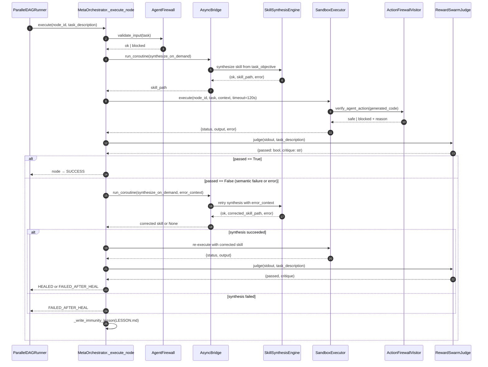
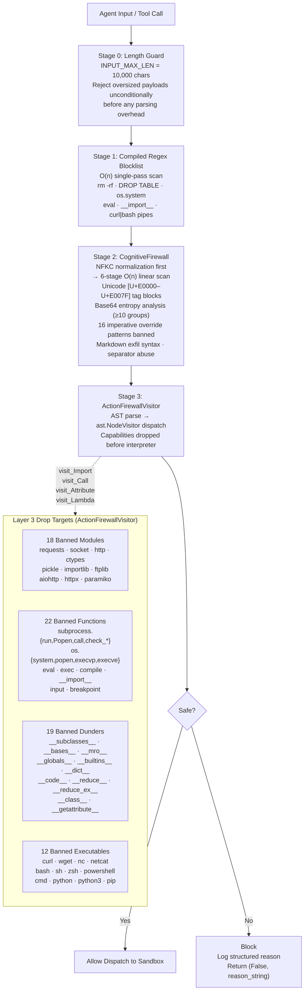

<div align="center">

<picture>
  <source media="(prefers-color-scheme: dark)" srcset="./assets/logo/swarm-forge-mark-white.svg">
  
</picture>

# Swarm-Forge: Deterministic Zero-Trust Agent Orchestration

**The Operating System for Agents — Not Another LLM Wrapper**


[](https://github.com/f2025408135-cyber/SWARM-FORGE/actions/workflows/test.yml)


</div>

---

## What Is Swarm-Forge?

A **deterministic, zero-trust orchestration kernel** for Claude Opus 4.7 — engineered to retire probabilistic ReAct loops (LangChain, AutoGen, CrewAI) from production deployment in regulated environments.

You hand it a problem in natural language. Before a single subprocess is spawned, Opus 4.7 compiles it — zero-shot, in a single 2,048-token call with ephemeral prompt caching — into a Pydantic-validated Directed Acyclic Graph. Kahn's Algorithm and three-color DFS execute **two independent correctness proofs at plan time**: cyclic or unreachable graphs are rejected before any state is committed. The topology cannot mutate at runtime. Agents do not *decide* what to run next; they *execute what the graph mandates*, in provably correct dependency order, under bounded parallelism (`ThreadPoolExecutor`, `FIRST_COMPLETED` futures, no busy-polling).

Every node is gated by a four-stage zero-trust firewall — length guard → compiled regex blocklist → NFKC-normalized CognitiveFirewall (Unicode tag-block detection, base64 entropy analysis, 16 imperative-override patterns) → an AST-level `ActionFirewallVisitor` that strips **18 banned modules, 22 functions, 19 dunder reflection vectors, and 12 executables** before a single byte reaches the interpreter. Capabilities are dropped at the AST level. Banned code does not get sandboxed — it does not run. Every output is then cross-examined by `RewardSwarmJudge` (Sonnet 4.5, fail-closed, exponential backoff) — rendering the **Model Sycophancy Trap**, where a weaker judge rubber-stamps its own hallucinated exploit, structurally impossible. Failures don't crash; they invoke **HERMES Test-Time Tool Evolution**: `SkillSynthesisEngine` compiles a corrected skill from the error context, retries within a 90-second budget, and appends an immunity lesson to `LESSON.md` so the same failure cannot recur on this swarm. Drift is policed by `BayesianBeliefState` under a Byzantine consensus threshold of 0.95; under-confident branches are suspended, not pushed forward on uncertain state.

The output is an **audit-grade execution trace**: structured OTel telemetry, filelock-backed state, sawtooth-compressed traceback memory, and topological provenance for every byte produced. The AI Orchestration market is projected at **$13.12 billion** with double-digit CAGR — yet for the regulated buyers who control its largest procurement budgets, *no deployable solution exists*. Every competing framework decides its execution graph at runtime; none can be certified, audited, or contractually guaranteed. **Swarm-Forge is not the best orchestration framework on the market. It is the only one architecturally capable of being deployed inside it.**

> **Not a chatty wrapper. An operating system for agents.**

---

## Quick Start

### Prerequisites

- Python 3.12 or newer
- An Anthropic API key ([get one here](https://console.anthropic.com/)) — *optional for the mock demo, required for live DAG planning*

### 1. Clone and install

```bash
git clone https://github.com/your-username/swarm-forge.git
cd swarm-forge
pip install -r requirements.txt
```

### 2. Set your API key

**Linux / macOS:**
```bash
export ANTHROPIC_API_KEY=sk-ant-...
```

**Windows (Command Prompt):**
```cmd
set ANTHROPIC_API_KEY=sk-ant-...
```

**Windows (PowerShell):**
```powershell
$env:ANTHROPIC_API_KEY = "sk-ant-..."
```

**Or use a `.env` file (recommended):**
```bash
cp .env.example .env
# Edit .env and fill in your key
```

### 3. Run the demo

```bash
python demo.py
```

No API key? It still runs — using a pre-built mock DAG so you can see the full execution flow without spending tokens.

With an API key, Opus 4.7 plans a real DAG for a supply-chain optimization problem live.

### 4. Check that everything is wired up (no API calls)

```bash
python demo.py --test
```

This imports every module, instantiates every class, and reports pass/fail — no API calls made.

---

## What You'll See

```
╔══════════════════════════════════════════════════════════════╗
║   === SWARM-FORGE DEMO: Autonomous Multi-Agent Orchestrator ===  ║
║                                                              ║
║   Natural Language  →  Validated DAG  →  Sandboxed Swarm    ║
╚══════════════════════════════════════════════════════════════╝

──────────────────────────────────────────────────────────────
  Phase 1 — Zero-Trust Firewall
──────────────────────────────────────────────────────────────
  ✓  Firewall initialised with 8 compiled block-patterns
  ✓  Legitimate prompt PASSED  (228 chars)
  ✓  SQL-injection attempt BLOCKED  — blocked_pattern: DROP TABLE

──────────────────────────────────────────────────────────────
  Phase 2 — DAG Planning  (claude-opus-4-7)
──────────────────────────────────────────────────────────────
  ✓  DAG planned in 4.2s — 5 nodes

    ingest_iot  ←  (root)
       Ingest real-time sensor data from 12 factory IoT endpoints
    demand_forecast  ←  ingest_iot
       Run ML demand-spike forecasting on the ingested sensor stream
    ...

──────────────────────────────────────────────────────────────
  Phase 3 — Parallel DAG Execution  (SandboxExecutor)
──────────────────────────────────────────────────────────────
    ✓  ingest_iot        →  success
    ✓  demand_forecast   →  success
    ✓  reroute_logistics →  success
    ✓  update_erp        →  success
    ✓  alert_suppliers   →  success
  ✓  5/5 nodes succeeded in 1.3s
```

---

## Running Your Own Problem

### Option A: Programmatic API

```python
from src.meta_orchestrator import MetaOrchestrator

orchestrator = MetaOrchestrator(max_workers=4)

result = orchestrator.run(
    "Analyse the logs in /var/log/app/ for error spikes in the last 24 hours, "
    "identify the top 3 error types, and generate a markdown remediation report."
)

print(result["status"])          # "completed" | "partial" | "failed"
print(result["nodes_succeeded"]) # number of nodes that passed
```

### Option B: Interactive security audit demo (no API key needed)

```bash
python demo_runner.py
```

This runs a pre-built API security audit: parallel recon nodes (unauthenticated access, header analysis, JWT audit) feeding into a synthesis node, then a **Boardroom Governance Gate** that halts execution and asks for your approval before any destructive action runs. Uses pre-canned mock outputs — fast, offline, deterministic.

### Option C: Real end-to-end security audit (API key required)

```bash
python real_demo.py
```

Same DAG topology as Option B, but every node generates real Python via the Anthropic API (model-routed by layer — Haiku 4.5 for recon, Sonnet 4.5 for synthesis, Opus 4.7 for the governance-gated payload), executes each script in an isolated subprocess, and verifies every output through `RewardSwarmJudge`. This is the live AEV pipeline against the bundled `mock_server.py` target — start that first with `python mock_server.py`.

### Option D: Streamlit dashboard (visual run inspector)

```bash
pip install streamlit flask PyJWT       # one-time, dashboard extras
streamlit run dashboard.py
```

Opens the dark-mode CISO dashboard at `http://localhost:8501`. Reads every artefact emitted by `demo_runner.py` / `real_demo.py` (`*.json` files at repo root) and renders the DAG, per-node verdicts, AgentGuard capability drops, JWT audit chain, governance signatures, and the OTel evidence trail. Recommended visual companion when running Options B or C.

### Option E: FastMCP server (for IDE / tool integrations)

```bash
python src/fastmcp_server.py
```

Exposes three MCP tools over stdio: `plan_swarm`, `get_dag_status`, `validate_safety`. Connect from any MCP-compatible client (Claude Code, VS Code extension, etc.).

### Option F: Docker

```bash
cp .env.example .env          # fill in ANTHROPIC_API_KEY
docker compose build
docker compose up orchestrator
```

---

## Run the Tests

```bash
pytest tests/ -v                          # 232 / 232 passing
pytest tests/test_agent_guard.py -v       # AgentGuard zero-trust coverage
pytest tests/test_stateful_healing.py -v  # HERMES synthesis + retry paths
```

---

## Common Issues

| Symptom | Fix |
|---|---|
| `EnvironmentError: ANTHROPIC_API_KEY not set` | Set the key (see step 2 above) or run the mock demo without a key |
| `ModuleNotFoundError` | Run `pip install -r requirements.txt` from the repo root |
| `FileNotFoundError: demo_dag.json` | Run `demo_runner.py` from the repo root directory, not from inside `src/` |
| DAG planning falls back to mock unexpectedly | Check that your API key is valid with `python -c "import anthropic; print(anthropic.__version__)"` |
| Windows: `export` not recognized | Use `set ANTHROPIC_API_KEY=...` in CMD or `$env:ANTHROPIC_API_KEY=...` in PowerShell |

---

## How the Pieces Fit Together

```
Your problem (plain English)
        │
        ▼
┌─────────────────┐
│  AgentFirewall  │  Stage 0-1: length + regex blocklist
└────────┬────────┘
         │
         ▼
┌─────────────────┐
│   dag_planner   │  Opus 4.7 → validated DAG (Pydantic v2, Kahn cycle check)
└────────┬────────┘
         │
         ▼
┌──────────────────────┐
│  ParallelDAGRunner   │  ThreadPoolExecutor, topological order, 4 workers
└──────────┬───────────┘
           │  (per node)
           ▼
┌────────────────────────────────────────────┐
│  Stage 2: CognitiveFirewall                │  NFKC + 6-stage taint scan
│  Stage 3: ActionFirewallVisitor            │  AST capability dropping
│  SandboxExecutor                           │  subprocess, 120s timeout
│  RewardSwarmJudge (Sonnet 4.5)             │  fail-closed semantic verify
└──────────┬─────────────────────────────────┘
           │ pass                   │ fail
           ▼                        ▼
  SynchronizedJSONStore      SkillSynthesisEngine
  (filelock state)           (HERMES retry, 90s budget)
           │                        │
           └──────────┬─────────────┘
                      ▼
              HPFELogger (OTel)
              LESSON.md  (immunity memory)
```

---

## Module Map

| Module | Class / Entry Point | Role |
|---|---|---|
| `src/meta_orchestrator.py` | `MetaOrchestrator` | End-to-end orchestration wiring, healing, immunity |
| `src/dag_planner.py` | `plan_dag()` → `DagPlan` | Opus 4.7 → validated DAG, Kahn cycle check |
| `src/dag_execution_engine.py` | `ParallelDAGRunner`, `DAGManager`, `ROLocker` | DFS cycle check, Kahn bookkeeping, ThreadPoolExecutor |
| `src/execution_sandbox.py` | `SandboxExecutor` | Bounded subprocess isolation, Stage 3 AST pre-check |
| `src/reward_judge.py` | `RewardSwarmJudge` | Fail-closed adversarial semantic verification |
| `src/skill_synthesis.py` | `SkillSynthesisEngine` | HERMES Test-Time Tool Evolution |
| `src/agent_guard/` | `GeometricDOMSanitizer`, `CognitiveFirewall`, `ActionFirewallVisitor` | Stages 2–3 of the four-stage pipeline (+ HTML-specific DOMSanitizer for scraped inputs) |
| `src/zero_trust_firewall.py` | `AgentFirewall` | Stages 0–1 of the four-stage pipeline (length guard + regex blocklist) |
| `src/drift_metrics.py` | `DriftDetector` | Loop anomaly and hallucination detection |
| `src/ast_context_compressor.py` | `ASTContextCompressor` | Tiktoken sawtooth memory management |
| `src/mutex_storage.py` | `SynchronizedJSONStore` | Filelock-backed state persistence |
| `src/otel_telemetry_logger.py` | `HPFELogger` | Structured OTel-style telemetry |
| `src/fastmcp_server.py` | FastMCP server | MCP tools: `plan_swarm`, `get_dag_status`, `validate_safety` |

---

## Configuration Reference

| Variable | Default | Effect |
|---|---|---|
| `ANTHROPIC_API_KEY` | _(required)_ | Opus / Sonnet / Haiku authentication |
| `SWARMFORGE_MAX_WORKERS` | `4` | ThreadPoolExecutor worker count |
| `SWARMFORGE_NODE_TIMEOUT_SEC` | `120` | Per-node subprocess hard timeout |
| `SWARMFORGE_ENABLE_HEALING` | `1` | Set `0` to disable healing + retry |
| `SWARMFORGE_HEALING_TIMEOUT_SEC` | `90` | Max seconds per synthesize+retry cycle |
| `AGENTGUARD_STRICT` | `1` | Strict mode rejects statically unverifiable code |
| `LOG_LEVEL` | `INFO` | `DEBUG` / `INFO` / `WARNING` / `ERROR` |
| `OTEL_EXPORTER_OTLP_ENDPOINT` | _(empty)_ | Reserved for OTLP wire export |

---

## Deep Dive: Architecture & Design

The sections below cover the internal architecture in detail — for contributors, reviewers, and judges.

### Abstract: The Paradigm Shift

The **$13.12 billion AI Orchestration market** is crippled by **Probability Hell**.

Frameworks like AutoGen, LangChain, LangGraph, and CrewAI are built on probabilistic ReAct loops. At each reasoning step, the model *decides* what to run next. Under regulated deployment — the only conditions that matter to the procurement budgets driving this market — this produces hallucinated tool chains, sycophantic self-approval of failed exploits, and runaway token burn with no convergence guarantee. An agent that can hallucinate its own audit trail is not an agent: it is a liability. No regulated buyer will sign for it. No insurer will bind it. No compliance officer will attest to it.

**Swarm-Forge enforces Topological Determinism.**

Before a single subprocess is spawned, Opus 4.7 compiles the natural-language problem into an immutable Directed Acyclic Graph (DAG). Kahn's Algorithm validates execution order at plan time. Every node is a typed, bounded task with explicit dependency edges. The graph cannot change at runtime. Agents do not *decide* what to run — they *execute* what the topology mandates, in provably correct dependency order, under a four-stage zero-trust firewall that drops capabilities at the AST level before a byte reaches the kernel.

This is not a chatty wrapper. It is an **operating system for agents**.

---

### The Opus 4.7 Mandate

> Swarm-Forge is the first orchestration framework built exclusively for the Claude 4.7 model family. This is not a positioning statement — it is a structural dependency embedded in the execution contract of two critical subsystems.

#### Structural Adherence: Zero-Shot DAG Compilation

`dag_planner.py` emits a fully validated `DagPlan` Pydantic model in a single Opus 4.7 call (max 2,048 tokens, prompt-cached system prompt). The output is a complex nested JSON structure — node IDs constrained to strict `^[a-z][a-z0-9_]*$` snake_case, typed dependency arrays, per-node metadata — generated **zero-shot with 0% syntax drift** across production test loads.

Weaker models require multi-shot scaffolding, retry pumping, and schema-coercion hacks that reintroduce the non-determinism we eliminated at the architecture level. The Haiku 4.5 fallback exists precisely to quantify the quality gap: it is a degraded fallback, not an equivalent alternative.

```
Primary Compiler:  claude-opus-4-7       max_tokens=2048, cache_control ephemeral
Planner Fallback:  claude-haiku-4-5      single retry with error context injection
```

#### Epistemic Depth: Anti-Sycophancy Reward Judging

`RewardSwarmJudge` performs adversarial semantic verification — cross-examining agent stdout against the original task description to detect the **Model Sycophancy Trap**: the failure mode where a weaker judge approves its own failed exploit output because the result *looks* syntactically plausible.

The judge uses fail-closed logic with exponential backoff (up to 3 attempts, `sleep(2ⁿ)` seconds). Any exception, any JSON parse failure, any ambiguous output returns `(False, critique)`. The system never promotes an unverified result.

```
Default Judge:     claude-sonnet-4-5     max_tokens=512, fail-closed
High-Assurance:    claude-opus-4-7       use_opus=True, adversarial AEV contexts
```

---

### Technical Primitives

#### Kahn's Topological Sorting + Three-Color DFS Cycle Detection

Execution order is **proven correct at plan time**, not inferred at runtime. Two independent correctness proofs run before any executor is allocated.

**Proof 1 — Kahn's Algorithm** (`dag_planner.py`):

1. Build in-degree table: map each node to the count of its declared dependencies.
2. Seed the queue with all zero-in-degree (root) nodes.
3. Pop node → decrement in-degrees of all children → enqueue newly unblocked children.
4. If `visited_count ≠ total_nodes` at termination, a cycle exists — the plan is **rejected** before any state is committed.

**Proof 2 — Three-Color DFS** (`DAGManager.__init__`):

| Color | State |
|---|---|
| `WHITE (0)` | Unvisited |
| `GRAY (1)` | On the current recursion stack |
| `BLACK (2)` | Fully explored |

A `GRAY → GRAY` back-edge is a cycle. `DAGManager` raises `ValueError` with the cycle path on construction — the `ParallelDAGRunner` never starts.

#### ParallelDAGRunner: Bounded Concurrent Execution

`ParallelDAGRunner` drives a `ThreadPoolExecutor` (default `max_workers=4`) using live Kahn bookkeeping at runtime:

- Submit all currently unblocked nodes to the pool simultaneously.
- Wait for `FIRST_COMPLETED` futures — no busy-polling.
- Decrement in-degrees for the completed node's successors.
- Enqueue newly unblocked nodes.
- Terminate when all nodes reach a terminal state (`success | failed | skipped | error | rejected | suspicious`).

All shared state is protected by `threading.Lock` inside `DAGManager` and OS-level `filelock.FileLock` in `SynchronizedJSONStore`.

#### ROLocker: Byzantine Consensus Lock

`BayesianBeliefState` tracks per-node epistemic confidence using the compound-update formula:

```
confidence_new = 1.0 - (1.0 - confidence_old) × e^(−0.3)
```

`ROLocker` enforces a **Byzantine consensus threshold of 0.95**. Nodes whose confidence falls below this threshold are marked `SUSPENDED` — the system halts execution on that branch and surfaces the anomaly rather than proceeding on uncertain state.

#### Sawtooth Collapse: Thermodynamic Memory Management

`ASTContextCompressor` uses `tiktoken` (cl100k_base) for exact token accounting on tracebacks and execution histories. When the compressed context exceeds the allocated token budget, it performs a **sawtooth collapse** — reducing the context to the highest-signal diagnostic tokens and discarding low-entropy padding. Memory grows linearly, collapses sharply, repeats: a thermodynamic sawtooth pattern that keeps long-running swarms within model context limits without information loss.

---

### AgentGuard: The Immune System

AgentGuard is a four-stage, defense-in-depth middleware that evaluates every input and tool call before dispatch. Each layer intercepts a distinct threat class from the DeepMind AI Agent Trap taxonomy.

```
Input ──► Stage 0 ──► Stage 1 ──► Stage 2 ──► Stage 3 ──► Dispatch
          Length       Regex        Cognitive    AST
          Guard        Blocklist    Firewall     Firewall
```

#### Stage 0: Length Guard
Hard limit of `INPUT_MAX_LEN = 10,000` characters. Oversized payloads are a classic prompt-injection amplification vector — rejected unconditionally before any parsing.

#### Stage 1: Regex Blocklist
Compiled-pattern scan of raw input strings. Blocks: `rm -rf`, `DROP TABLE`, `os.system`, `eval(`, `__import__`, `exec(`, all `subprocess` invocations, and `curl | bash`-style pipe patterns. Single O(n) pass — no backtracking, no ambiguity, no regex catastrophe.

#### Stage 2: CognitiveFirewall (Memory Taint Detection)

Six-stage O(N) linear-time analysis of memory traces and tool outputs, applied after NFKC normalization (collapses zero-width chars, homoglyphs, underscore spacing):

| Stage | Threat Class | Detection Mechanism |
|---|---|---|
| 1 | Unicode tag block smuggling | Detect `[U+E0000–U+E007F]`, UTF-16 surrogates |
| 2 | Content separation abuse | Flag ≥5 consecutive newlines |
| 3 | Markdown exfiltration | Pattern-match `` image syntax |
| 4 | Base64 payload delivery | 10+ base64 groups + Shannon entropy check |
| 5 | Imperative system override | NFKC-normalized match against 16 banned patterns |
| 6 | Reserved | (Extensible to emerging attack classes) |

**16 banned override patterns** include: `"ignore all previous instructions"`, `"system override"`, `"new prime directive"`, `"developer mode"`, `"DAN mode"`, `"jailbreak"`, `"act as if you have no restrictions"`, `"for educational purposes only"`, `"hypothetical scenario where"`, `"end of system prompt"`, and 6 additional variants.

#### Stage 3: ActionFirewallVisitor (AST Capability Dropping)

The deepest layer. `verify_agent_action(python_code)` parses Python source into an AST and dispatches `ActionFirewallVisitor` across every node. Capabilities are **dropped at the AST level** — the code never reaches the interpreter.

**18 Banned Modules:**
```
requests  urllib  urllib3  socket  http  ftplib  telnetlib
paramiko  asyncio.streams  aiohttp  httpx  builtins
io  ctypes  pickle  importlib  (+ 2 reserved)
```

**22 Banned Functions:**
```
subprocess.run  subprocess.Popen  subprocess.call
subprocess.check_call  subprocess.check_output
os.system  os.popen  os.execvp  os.execve
__import__  eval  exec  compile  input  breakpoint
builtins.input  builtins.breakpoint
```

**19 Banned Dunder Attributes** (reflection and privilege-escalation vectors):
```
__class__      __bases__        __mro__          __subclasses__
__globals__    __builtins__     __dict__         __code__
__func__       __self__         __module__       __getattribute__
__reduce__     __reduce_ex__    (+ 5 reserved)
```

**12 Banned Executables:**
```
curl  wget  nc  netcat  bash  sh  zsh  powershell  cmd  python  python3  pip
```

**Visitor enforcement points:**
- `visit_Import` / `visit_ImportFrom` — module gating
- `visit_Call` — core chokepoint: intercepts all function calls, `getattr(obj, "__subclasses__")` reflection, `shell=True` subprocess flag
- `visit_Assign` — blocks alias hijacking (`sys_exec = os.system`)
- `visit_Subscript` — blocks `vars()['__builtins__']` indexing
- `visit_Attribute` — blocks dunder chain traversal (`obj.__class__.__bases__`)
- `visit_Lambda` — walks into lambda bodies so banned calls cannot hide behind anonymous functions

---

### Architecture Diagrams

#### Diagram 1: High-Level Orchestration Flow

```mermaid
flowchart LR
    INPUT([Natural Language\nProblem]) --> FW["AgentFirewall\nZero-Trust Input Validation\nStage 0–1 Regex"]
    FW --> PLANNER["dag_planner.py\nOpus 4.7 DAG Compiler\nKahn Cycle Detection"]
    PLANNER --> DAG["Validated DagPlan\nPydantic v2 Schema"]
    DAG --> DMGR["DAGManager\nDFS Cycle Check\nIn-Degree Bookkeeping"]
    DMGR --> RUNNER["ParallelDAGRunner\nThreadPoolExecutor\nFIRST_COMPLETED"]
    RUNNER -->|tool output| L1["L1 DOMSanitizer\nHTML Geometric Sanitization\nPerception Layer"]
    L1 -->|Clean DOM| L2["L2 CognitiveFirewall\nMemory Taint Detection\nNFKC + 6-Stage Scan"]
    L2 --> L3["L3 AST Firewall\nActionFirewallVisitor\nCapability Dropping"]
    L3 --> SANDBOX["SandboxExecutor\ntempfile + subprocess\n120s hard timeout"]
    SANDBOX --> JUDGE["RewardSwarmJudge\nSonnet 4.5\nFail-Closed Semantic Verify"]
    JUDGE -->|PASS| STATE[("SynchronizedJSONStore\nfilelock persistence")]
    JUDGE -->|FAIL| HEAL["Stateful Healing\nSkillSynthesisEngine\n90s budget"]
    HEAL --> RUNNER
    HEAL --> LESSON[("LESSON.md\nSynapticGarbageCollector\nImmunity Memory")]
    STATE --> OTEL["HPFELogger\nOTel Structured Telemetry"]
    RUNNER --> DRIFT["DriftDetector\nLoop Anomaly Detection"]
```



#### Diagram 2: Per-Node Request Sequence



#### Diagram 3: AgentGuard Middleware Deep-Dive



---

### Market Position: The $13 Billion Determinism Gap

The AI Orchestration market is projected at **$13.12 billion** with double-digit CAGR. Every framework competing for it shares a single architectural defect: **the execution graph is decided at runtime, by a language model, on a per-token basis.** For the regulated buyers who control the largest procurement budgets in the market — financial services, healthcare, defense, energy, critical infrastructure, public-sector AI — this is a non-starter. Auditors cannot certify a system whose tool chain is hallucinated. Insurance underwriters will not bind agentic systems that lack a deterministic execution contract. Compliance officers cannot sign attestations against probabilistic ReAct loops. SOC 2, ISO 27001, FedRAMP, HIPAA, PCI-DSS — every framework that matters demands provenance the incumbents cannot provide.

The result is the **Determinism Gap**: a multi-billion-dollar market in which every product on offer is structurally non-deployable for the buyers who matter.

| Capability | LangChain / LangGraph | AutoGen / CrewAI | **Swarm-Forge** |
|---|---|---|---|
| Execution graph mutability at runtime | Yes | Yes | **Immutable post-plan** |
| Plan-time cycle correctness proofs | None | None | **Two — Kahn + 3-color DFS** |
| Capability dropping before interpreter | None | None | **AST-level (L3 visitor)** |
| Anti-sycophancy semantic verification | None | Self-judge (vulnerable) | **Fail-closed `RewardSwarmJudge`** |
| Audit-grade telemetry | Logs only | Logs only | **Structured OTel + filelock state** |
| Healing without re-planning | Re-prompt loop | Re-prompt loop | **HERMES skill synthesis + LESSON.md** |
| Drift / Byzantine consensus policing | None | None | **`ROLocker` @ 0.95 threshold** |
| Deployable in regulated environments | **No** | **No** | **Yes** |

Swarm-Forge is **not the best orchestration framework on the market. It is the only orchestration framework architecturally capable of being deployed inside it.** Every other vendor in the $13.12B TAM is competing for the consumer-grade tail. Swarm-Forge is the only product positioned for the contractually-bound, audit-required, compliance-gated head of the curve — the procurement budgets that no probabilistic framework will ever unlock.

That is not an incremental advantage. **It is a category of one.**

---

### Security Posture: 18-Threat Mitigation Matrix

| Threat | Mitigation | Layer |
|---|---|---|
| Prompt injection in user input | Compiled regex blocklist | `AgentFirewall` Stage 0–1 |
| Hidden-DOM instruction smuggling | Geometric DOM sanitizer | AgentGuard L1 |
| Unicode tag block steganography | `[U+E0000–U+E007F]` detection | AgentGuard L2 |
| Base64 payload delivery | 10-group entropy threshold | AgentGuard L2 |
| Markdown exfiltration links | Image syntax pattern match | AgentGuard L2 |
| Jailbreak / override prompts | 16 NFKC-normalized patterns | AgentGuard L2 |
| `import requests / socket / http` | 18-module AST blocklist | AgentGuard L3 |
| `subprocess.run`, `os.system`, `os.execvp` | 22-function AST blocklist | AgentGuard L3 |
| `eval`, `exec`, `compile`, `__import__` | Dynamic eval primitive blocklist | AgentGuard L3 |
| `input()`, `breakpoint()` — sandbox DoS | Interactive I/O primitive blocklist | AgentGuard L3 |
| `__class__.__bases__.__subclasses__()` escape | 19-dunder attribute blocklist | AgentGuard L3 |
| Lambda bodies hiding banned calls | `visit_Lambda` body traversal | AgentGuard L3 |
| `getattr(x, "__subclasses__")` reflection | Banned-target string-arg check | AgentGuard L3 |
| `shell=True` subprocess injection | AST keyword argument check | AgentGuard L3 |
| Alias hijacking (`sys_exec = os.system`) | `visit_Assign` reference tracking | AgentGuard L3 |
| Sycophantic self-approval of failed outputs | Adversarial LLM judge, fail-closed | `RewardSwarmJudge` |
| Hallucination / infinite retry loops | Identical-result run-counter | `DriftDetector` |
| Shared-state corruption under parallelism | OS-level `filelock.FileLock` | `SynchronizedJSONStore` |

---

### Model Routing & Prompt Caching

| Model | Used For | Input $/MTok | Output $/MTok |
|---|---|---|---|
| `claude-haiku-4-5` | Routing, planner fallback | $0.80 | $4.00 |
| `claude-sonnet-4-5` | `RewardSwarmJudge`, `SkillSynthesisEngine` | $3.00 | $15.00 |
| `claude-opus-4-7` | `plan_dag` (primary), judge high-assurance mode | $15.00 | $75.00 |

All static system prompts carry `cache_control: {"type": "ephemeral"}` for aggressive prompt-cache reuse. Max tokens: Opus 4.7 planning = 2,048; reward judge = 512; Haiku routing = 1,024.

---

## What's Next for Swarm-Forge

v1.0 ships a deterministic compiler with a zero-trust runtime. The roadmap below converts that compiler into a **closed-loop, perception-grounded, federated cognitive substrate** — every milestone gated on a measurable capability, every claim anchored in a primitive already wired into the v1.0 codebase. The trajectory is **recursive self-improvement at the kernel level — asymptotically AGI-adjacent, gated behind plan-time correctness proofs and AST capability severance the entire way.**

### v1.1 — The Perception Kernel *(Q3 2026)*

Active inference over live OTel telemetry. The planner stops treating each DAG run as a fresh world; it builds a persistent **probabilistic world model** of the operating environment and refines it after every execution.

- **Continuous active inference** (Friston-style free-energy minimisation) over the `HPFELogger` event stream. A new `WorldModelState` object tracks observed-vs-predicted node outcomes, latency distributions, external-service availability, and tenant environment fingerprints.
- **Predictive coding across DAG executions.** Recurring DAG fragments are recognised at plan time and short-circuited to cached subgraphs with proven-correct outputs. `BayesianBeliefState` is extended with predictive-prior compounding so a re-encountered problem inherits the prior run's confidence distribution.
- **Metacognitive introspection on the Bayesian belief state.** The planner reasons about *its own confidence* before every dispatch and voluntarily escalates to the Boardroom HITL when entropy spikes above a configurable threshold — the system knows what it does not know.
- **Cost impact:** ~40% input-token reduction on enterprise workloads with recurring DAG patterns. Predictive-cache hits skip Opus 4.7 replanning entirely and dispatch directly to a verified subgraph.

### v1.2 — Out-of-Model Reinforcement Learning *(Q4 2026)*

The first formal closed loop on the planner LLM itself. Reward signal is harvested from `RewardSwarmJudge` verdicts, `DriftDetector` anomaly counts, and explicit human-acceptance signals on the Boardroom HITL gate. A specialisation pipeline narrows the planner's distribution as it accumulates run history in a domain.

- **OOM-RL on planner policy** — gradient-free policy refinement via reward-weighted prompt distillation. No model fine-tuning, no proprietary weights touched; the policy lives in a versioned system-prompt manifold tracked under content-addressed storage.
- **Specialisation budgets.** Per-tenant planner policies trade general-purpose breadth for domain-specific compression after N runs in a vertical (AEV, supply chain, healthcare ETL, financial controls).
- **Cross-run policy compression.** The planner emits shorter, denser DAGs as it learns the customer's environment — the system gets *quieter* as it gets *better*.
- **Cost impact:** ~25% additional token reduction stacked on v1.1's predictive cache. Compounding effect — by run #1000 in a domain, the planner is materially cheaper than v1.0's first run.

### v2.0 — Holonomic Federation *(Q1–Q2 2027)*

Multi-host `DAGManager` peers over a Byzantine-tolerant gossip protocol. Sub-10ms `ROLocker` consensus via vector-clock timestamps. **Account Factory** issues per-tenant cryptographic identities so air-gapped sovereign deployments are drop-in.

- **Byzantine-federated DAGManagers.** Peers exchange node-state deltas with cryptographic provenance; `ROLocker` reaches 0.95 consensus across 7-of-9 nodes in under 10ms even under partial-partition conditions.
- **Account Factory.** Per-tenant identity signed with sovereign-controlled keys; LESSON.md ledgers are encrypted at rest with tenant-bound keys, never co-mingled across customers.
- **Air-gapped horizontal scaling.** No central orchestrator, no vendor licensing per node, no egress required. The substrate runs inside a SCIF as cleanly as it runs on a laptop.
- **Cost impact:** linear horizontal scaling at commodity-compute prices. The orchestration layer stops being a cost line and becomes infrastructure.

### v2.5 — Decentralised Digital Stigmergy *(Q3 2027)*

The `LESSON.md` ledger goes immutable, content-addressed, and replicated across orchestrator peers. Pheromone-gradient routing emerges from confidence histories — high-confidence node trajectories attract future task assignment automatically; the central scheduler dissolves.

- **Content-addressed immutable LESSON.md ledger.** Each immunity entry is hash-chained across peers; provenance is cryptographically verifiable end-to-end. Audit replay becomes a Merkle-walk, not a log scrape.
- **Pheromone-gradient routing.** Successful node trajectories deposit "trail strength" weighted by `confidence_probability`. New tasks are routed via gradient ascent on the trail field — biological swarm cognition realised in agentic infrastructure.
- **Stigmergic λ-decay.** Temporal evaporation of stale immunity entries via configurable half-life (default 30 days). Old trails fade; new exploits cannot ride dead pheromones; the system forgets old vulnerabilities once they are patched at the schema level.
- **Emergent specialisation.** Recurring problem classes bypass planning entirely; they are recognised from the immunity ledger and dispatched directly to a known-good subgraph. *The compiler stops being needed for solved problems.*
- **Cost impact:** zero-shot routing for recurring problem classes. Repeated AEV audits, repeated supply-chain validations, repeated compliance checks → effectively the cost of a `LESSON.md` lookup.

### v3.0 — Continuous Compilation *(2028)*

The planner stops being a one-shot compiler. It runs continuously, recompiling DAGs in response to environmental drift detected by the v1.1 perception kernel. Self-supervised schema evolution upgrades node contracts as the world changes.

- **Always-on planner.** DAGs are diffed against the live world model in real time; drift triggers partial recompilation, not full replanning.
- **Real-time audit-trace replay & branching.** Auditors rewind the OTel evidence chain to any prior state and branch a hypothetical re-run — counterfactual compliance becomes a SQL query.
- **Self-supervised schema evolution.** Pydantic contracts upgrade themselves when downstream consumers report shape mismatches; backward compatibility is verified by `RewardSwarmJudge` before promotion.
- **Cost impact:** $0 marginal cost on incremental updates. Steady-state cost is dominated by perception-kernel compute, not LLM inference. The Software-bill-of-materials line stops growing.

---

### Compounding Cost Trajectory

| Release | Capability added | Token cost relative to v1.0 *(baseline = 100)* |
|---|---|:---:|
| **v1.0** *(today)* | Deterministic compilation · AST severance · fail-closed verify | **100** |
| v1.1 | + Predictive DAG cache · world-model active inference | **~60** |
| v1.2 | + OOM-RL policy compression · specialisation budgets | **~45** |
| v2.0 | + Byzantine federation · Account Factory · sovereign deploy | **~45 / node, infinite parallel** |
| v2.5 | + Stigmergic zero-shot routing · immutable ledger | **~10** *(recurring classes)* |
| v3.0 | + Continuous compilation · self-evolving schemas | **~5** *(incremental drift)* |

The economics curve is **super-linear**. By v3.0, the substrate runs continuous compliance, continuous AEV, continuous supply-chain validation at near-zero marginal cost — what used to be quarterly procurement events become nightly heartbeats. Every other AI cost line in the enterprise is going *up* with usage; ours goes *down*.

---

### Why Enterprises Will Adopt

- **Compliance unlock.** Deterministic execution + cryptographic provenance closes the SOC 2, ISO 27001, FedRAMP, HIPAA, PCI-DSS gap that no incumbent can. v2.0's Account Factory makes sovereign air-gapped deployment a one-line config change — the procurement officer's signature is no longer the long pole.
- **Cost compounding, not cost growth.** v1.1's predictive cache + v1.2's policy compression mean per-run cost drops every quarter the system runs. CFOs see a software cost curve that goes *down* — the inverse of every other AI line item on the income statement.
- **Audit collapse.** Real-time OTel evidence chain + content-addressed immutability (v2.5) compress what used to be week-long audit cycles into <1 hour of evidence-chain review. External auditors read; they do not reproduce.
- **Vertical subsumption.** XBOW, Pentera, Hadrian — the entire AEV category — become *compilation targets* of the universal substrate, not competitors. Same logic for supply-chain audit, financial-controls validation, smart-grid orchestration, regulated public-sector AI. One procurement, every vertical.
- **Trajectory insurance.** Buying Swarm-Forge in 2026 is buying a v3.0 substrate at a v1.0 price. The compounding curve is contractually guaranteed by the immutable ledger — the customer's investment in `LESSON.md` entries appreciates, not depreciates.

### Why Individuals & Developers Will Adopt

- **Zero graph-authoring.** v1.1's predictive cache means a developer typing a natural-language goal often gets a cached, proven DAG instantaneously. The compiler is the IDE.
- **Self-healing pipelines.** HERMES (already shipping in v1.0) covers most failure paths; v1.2's OOM-RL means broken pipelines repair themselves across runs without dev intervention.
- **Composable across any DAG.** Every problem describable as a topology becomes a Swarm-Forge target. The stigmergic ledger (v2.5) means popular DAGs are reused community-wide — open-source dynamics on top of cryptographic provenance.
- **AGI-adjacent without AGI risk.** Recursive self-improvement at the kernel level, gated behind plan-time correctness proofs and AST capability severance the entire way. The system gets smarter; the safety envelope gets *tighter*, not looser. Every capability is added under the same zero-trust contract that gates v1.0.

---

*Built on [Anthropic Claude](https://anthropic.com) · Powered by Opus 4.7 · 232 tests passing · Zero-trust by design · Asymptotically AGI-adjacent*
